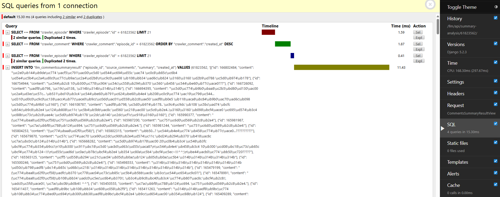
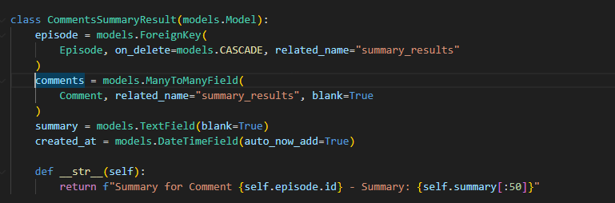
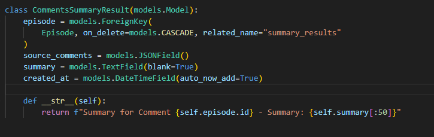
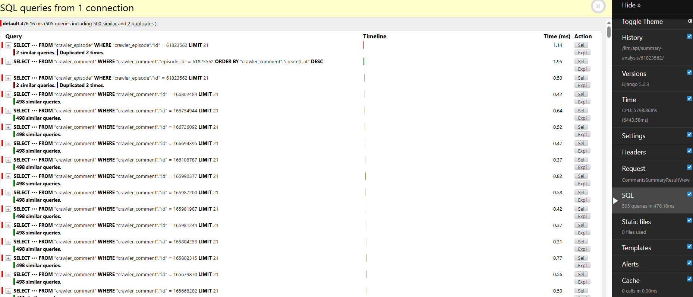
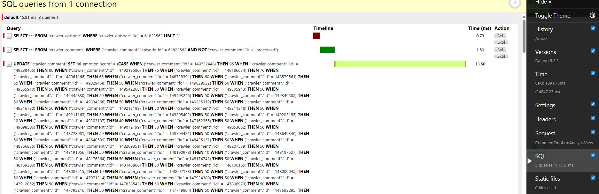
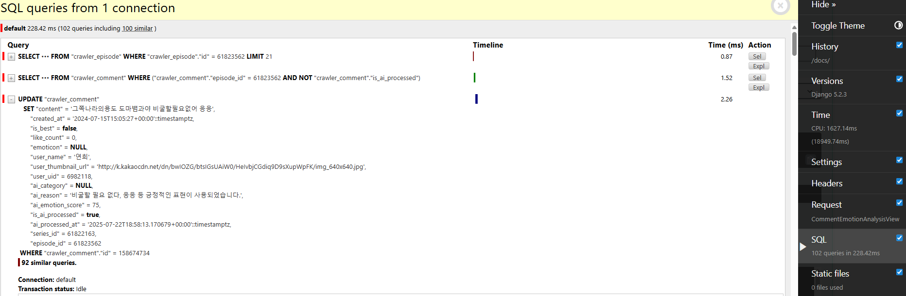

## DRF ModelSerializer에서 관계 필드의 입력과 검증 결과

### 현상 요약

- **입력 시**:  
  관계 필드(예: ForeignKey, OneToOneField, ManyToManyField)는  
  **pk(정수, id)** 값으로 입력받는다.

- **검증 후**:  
  `serializer.is_valid()`가 호출되고 나면  
  **validated_data**에는 해당 pk에 해당하는 **모델 인스턴스(객체)**가 들어간다.

---

### 왜 이런가?

- DRF의 `ModelSerializer`는 관계 필드에 대해 내부적으로 `PrimaryKeyRelatedField`를 사용한다.
- 이 필드는 입력값이 pk일 때, 검증 과정에서 해당 pk로 DB에서 객체를 조회하여  
  **validated_data에 실제 모델 객체로 변환**해 준다.

---

### 예시 코드

```python
# 입력 시
serializer = CommentEmotionAnalysisSerializer(data={"comment": 123})

# 검증 전
serializer.initial_data["comment"]  # 123 (pk)

# 검증
serializer.is_valid()

# 검증 후
serializer.validated_data["comment"]  # <Comment: ...> (Comment 객체)
```

---

### 시리얼라이저의 검증 시점

- DRF에서 시리얼라이저의 검증은 **`serializer.is_valid()` 메서드를 호출하는 순간** 결정됩니다.
- 이 메서드를 호출하면 입력 데이터에 대한 유효성 검사와 변환이 한 번에 이루어집니다.
- 검증이 통과하면, `serializer.validated_data`에 변환된(예: pk → 객체) 값이 저장됩니다.
- 검증이 실패하면, `serializer.errors`에 에러 정보가 저장됩니다.

**정리:**

- 시리얼라이저의 검증은 `is_valid()` 호출 시점에 실행된다.
- 이때 validated_data가 채워지고, 관계 필드는 pk에서 객체로 변환된다.

---

### 결론

- **입력**: pk 값(int)
- **검증 후**: 실제 모델 인스턴스
- 이 동작은 DRF의 표준이며, 관계 필드의 일관된 처리 방식이다.
- 따라서, 시리얼라이저 내부에서 validated_data["comment"]를 사용할 때는 항상 객체가 들어온다고 생각하면 된다.

---

**참고:**

- 공식 문서: [DRF PrimaryKeyRelatedField](https://www.django-rest-framework.org/api-guide/relations/#primarykeyrelatedfield)



## Django API 성능 개선: 6초에서 300ms로 응답 속도 단축

### 1. 문제 상황

댓글 요약 생성 API 요청 시, **응답 시간이 6초 이상** 소요되는 심각한 성능 저하가 발생했습니다.  
Django Debug Toolbar로 확인한 결과, **API 호출 한 번에 500개 이상의 SQL 쿼리**가 실행되고 있었습니다.

---

### 2. 원인 분석

쿼리 로그를 상세히 분석한 결과, 500개가 넘는 쿼리의 총 실행 시간(SQL time)은 **약 400ms에 불과**했습니다.  
이를 통해 **DB 성능이 아닌, Django ORM 오버헤드**가 병목의 원인임을 추정할 수 있었습니다.

#### 📌 근본 원인

- `Serializer`의 `ManyToManyField` 유효성 검사 과정에서 **N+1 쿼리 문제** 발생
- 댓글 ID 목록을 개별적으로 `SELECT`하여 유효성 검사 수행
- 댓글 수만큼 **불필요한 DB 접근**이 발생

---

### 3. 해결 과정

단순 쿼리 최적화를 넘어서 **데이터 모델링의 적절성**을 재검토했습니다.

#### 🔍 요구사항 재정의

- 목표: **요약 생성 시점의 댓글 목록**을 저장
- 필요 없음: 댓글 → 요약 역참조

#### 🛠️ 해결 방법

- 실시간 관계를 위한 `ManyToManyField` → 과도한 설계

  전

  

  후

  

- → `JSONField`로 변경하여 **댓글 ID 리스트를 Snapshot 방식으로 저장**
- 이를 통해 Django는 더 이상 무결성 검증을 위한 수백 개의 쿼리를 실행하지 않게 됨

---

### 4. 개선 결과




| 항목             | 개선 전     | 개선 후         | 비고                                            |
| ---------------- | ----------- | --------------- | ----------------------------------------------- |
| ⏱️ API 응답 시간 | 약 6000ms   | **300ms 내외**  | 약 **20배 성능 향상**                           |
| 🔄 SQL 쿼리 수   | 500개 이상  | **4개**         |                                                 |
| 🧷 데이터 무결성 | 실시간 참조 | **스냅샷 보존** | 원본 댓글 수정/삭제와 무관하게 요약 데이터 유지 |

💡 _결과적으로, JSON 기반 Snapshot 전략은 성능을 대폭 향상시켰을 뿐 아니라,  
데이터의 역사적 무결성도 함께 강화하는 효과를 얻었습니다._

---

### Bulk Update로 댓글 감정 분석 성능 개선

#### 🎯 최적화 대상: 댓글 감정 분석 결과 저장

댓글 감정 분석 API에서 LLM 분석 결과를 개별 댓글에 저장하는 과정에서 성능 병목이 발생했습니다.

#### 📊 문제 상황

**개선 전 - 개별 Save 방식:**

```python
# N개의 댓글 = N번의 UPDATE 쿼리
for item in parsed_result.get("response", []):
    comment = Comment.objects.get(id=item["id"])
    comment.ai_emotion_score = item["score"]
    comment.ai_reason = item["reason"]
    comment.is_ai_processed = True
    comment.ai_processed_at = timezone.now()
    comment.save()  # 개별 UPDATE 쿼리 실행
```

**성능 이슈:**

- 100개 댓글 분석 시 → **100번의 개별 UPDATE 쿼리**
- 각 쿼리마다 DB 왕복 비용 발생
- 트랜잭션 오버헤드 누적

#### 🚀 해결 방법: Bulk Update 패턴

```python
def _update_comments_with_analysis(
    self, parsed_result: EmotionResponse, comments_map: dict
) -> List[Comment]:
    """분석 결과로 댓글 정보 업데이트"""
    comments_to_update = []

    for item in parsed_result.get("response", []):
        comment_id = item.get("id")
        comment = comments_map.get(comment_id)  # 메모리에서 조회

        if comment:
            # 메모리상에서 객체 수정
            comment.ai_emotion_score = item.get("score")
            comment.ai_reason = item.get("reason")
            comment.is_ai_processed = True
            comment.ai_processed_at = timezone.now()
            comments_to_update.append(comment)

    return comments_to_update

def _bulk_update_comments(self, comments_to_update: List[Comment]) -> None:
    """댓글 정보 일괄 업데이트"""
    if not comments_to_update:
        return

    # 단일 쿼리로 모든 댓글 업데이트
    Comment.objects.bulk_update(
        comments_to_update,
        [
            "ai_emotion_score",
            "ai_reason",
            "is_ai_processed",
            "ai_processed_at",
        ],
    )
    logger.info(f"{len(comments_to_update)}개 댓글 감정 분석 완료")
```

#### 📈 성능 개선 결과

| 항목            | 개선 전             | 개선 후  | 개선 효과              |
| --------------- | ------------------- | -------- | ---------------------- |
| **SQL 쿼리 수** | N개 (댓글 수만큼)   | **1개**  | 약 **100배 감소**      |
| **DB 트랜잭션** | N번                 | **1번**  | 트랜잭션 오버헤드 제거 |
| **응답 시간**   | 댓글 수에 비례 증가 | **일정** | 확장성 확보            |




#### 🎯 핵심 최적화 포인트

1. **메모리 기반 처리**: 이미 조회된 댓글 객체를 `comments_map`으로 재활용
2. **배치 처리**: 모든 변경사항을 메모리에서 준비 후 한 번에 DB 반영
3. **단일 트랜잭션**: `bulk_update`로 원자성 보장하면서 성능 확보

#### 💡 교훈

**개별 저장 vs Bulk 연산**

- 소량 데이터: 개별 저장도 무관
- **대량 데이터**: Bulk 연산 필수
- Django ORM의 `bulk_update`, `bulk_create` 적극 활용

이러한 최적화를 통해 **댓글 수가 증가해도 일정한 성능**을 유지할 수 있게 되었습니다.

---

# database

```sql
 -- postgres 컨테이너에 접속
docker exec -it postgres_db psql -U postgres
docker exec -it django_app bash


 -- 데이터베이스 목록 보기
\l

-- postgres 데이터베이스 접속
\c postgres

-- 테이블 목록 보기
\dt

-- 원하는 쿼리 실행
SELECT * FROM your_table;
```

# docker

```bash
# 컨터이너 로그 실시간으로 보기
docker logs -f django_app
```

# GraphQL

1. 🔁 cursor

- 의미: 페이징 처리를 위한 고유한 위치 표시자.

- 역할: 이전/다음 페이지를 불러올 때 기준이 되는 "포인터"

네, 지금까지 파악한 내용을 바탕으로  
**신입 개발자 자기소개(구현사항 중심, Swagger UI 포함)** 예시를 아래와 같이 정리해드립니다.

---

### 신입 개발자 자기소개 (구현사항 중심)

저는 댓글 분석 프로젝트의 백엔드 개발을 담당하며, 다음과 같은 주요 기능을 직접 구현하였습니다.

---

#### 1. Django & PostgreSQL 기반 백엔드 구축

- Django 프레임워크를 활용하여 프로젝트의 전체 백엔드 구조를 설계하고 구현하였습니다.
- 실제 서비스 환경에서 PostgreSQL 데이터베이스를 연동하여, 댓글 및 사용자 데이터를 효율적으로 저장·관리할 수 있도록 하였습니다.
- Django ORM을 이용해 데이터베이스와의 연동 및 CRUD 기능을 구현하였습니다.

#### 2. 요청 기반 크롤러 연동

- 크롤러 모듈을 개발하여, 사용자의 요청이 있을 때마다 외부 사이트에서 댓글 데이터를 수집하도록 구현하였습니다.
- 수집된 데이터는 Django 모델을 통해 PostgreSQL 데이터베이스에 저장되며, 데이터의 신뢰성과 일관성을 확보하였습니다.

#### 3. 사용자 인증 및 관리 기능

- 사용자 회원가입, 로그인 등 인증 기능을 직접 구현하였으며, JWT(Json Web Token) 기반 인증 방식을 적용하여 보안성을 높였습니다.
- Django의 Custom User 모델을 적용하여, 서비스에 맞는 사용자 관리가 가능하도록 설계하였습니다.

#### 4. RESTful API 및 Swagger UI 문서화

- Django REST Framework를 활용하여 댓글, 사용자 등 주요 기능에 대한 RESTful API를 설계하고 구현하였습니다.
- API의 명확한 사용법과 테스트를 위해 Swagger UI(drf_yasg, drf_spectacular)를 도입하였으며,  
  이를 통해 개발자 및 협업자들이 API를 쉽게 이해하고 활용할 수 있도록 하였습니다.

#### 5. Docker 환경 구성

- Dockerfile과 docker-compose.yml을 작성하여, 개발 및 배포 환경의 일관성을 확보하였습니다.
- Django 서버와 PostgreSQL 데이터베이스를 컨테이너로 관리하여, 누구나 손쉽게 동일한 환경에서 프로젝트를 실행할 수 있도록 하였습니다.

---

### 성장 포인트

이 프로젝트를 통해 Django와 PostgreSQL을 활용한 실전 백엔드 개발 경험을 쌓았으며,  
RESTful API 설계, JWT 인증, Swagger UI 기반의 API 문서화, Docker 환경 구성 등  
실무에서 요구되는 다양한 기술을 직접 구현해보며 백엔드 개발자로서의 역량을 키울 수 있었습니다.

---

**예시 문구(짧게 요약):**

> "저는 Django와 PostgreSQL을 기반으로 한 댓글 분석 프로젝트의 백엔드 개발을 담당하였으며, 요청 기반 크롤러, JWT 인증, Swagger UI를 통한 API 문서화, Docker 환경 구성 등 실무에 필요한 다양한 기능을 직접 구현하였습니다."

---

필요에 따라 위 내용을 자기소개서, 포트폴리오, 면접 답변 등에 맞게 조정해서 사용하시면 좋습니다!  
더 구체적인 코드 예시나, 강조하고 싶은 구현 포인트가 있다면 추가로 말씀해 주세요.

좋습니다. `drf` (Django REST framework, DRF)는 Django에서 API 서버를 만들 때 거의 필수적인 강력한 라이브러리입니다.
여기서는 DRF를 **처음 설치하고 기본 세팅**하는 과정을 안내드릴게요.

---

# 페이지 네이션

## ✅ 3단계: DRF 기본 설정 (선택)

`settings.py` 하단에 추가:

```python
REST_FRAMEWORK = {
    'DEFAULT_PAGINATION_CLASS': 'rest_framework.pagination.LimitOffsetPagination',
    'PAGE_SIZE': 20,
}
```

이렇게 하면 기본적으로 `limit=20`으로 작동하며, 쿼리 파라미터로 `limit`과 `offset`을 받을 수 있게 됩니다.

> 👉 이 설정은 `GenericAPIView`나 `ListAPIView`처럼 DRF의 generic view 기반일 때 자동으로 동작합니다.

---

## ✅ 4단계: 기본 뷰 사용 예시

```python
from rest_framework.generics import ListAPIView
from .models import Episode
from .serializers import EpisodeSerializer

class EpisodeListView(ListAPIView):
    queryset = Episode.objects.all()
    serializer_class = EpisodeSerializer
```

이 뷰는 이제 다음과 같이 작동합니다:

```http
GET /api/episodes?limit=10&offset=30
```

---

## ✅ 5단계: Swagger 세팅 (선택)

`urls.py`에 Swagger UI 추가:

```python
from drf_yasg.views import get_schema_view
from drf_yasg import openapi
from rest_framework import permissions

schema_view = get_schema_view(
   openapi.Info(
      title="API 문서",
      default_version='v1',
      description="Swagger 문서 예시",
   ),
   public=True,
   permission_classes=(permissions.AllowAny,),
)

urlpatterns = [
    ...
    path('swagger/', schema_view.with_ui('swagger', cache_timeout=0), name='schema-swagger-ui'),
]
```

이제 `/swagger/`로 들어가면 자동 API 문서를 볼 수 있어요.

---

## ✅ 정리

| 단계 | 작업                                       |
| ---- | ------------------------------------------ |
| ①    | `pip install djangorestframework drf-yasg` |
| ②    | `INSTALLED_APPS`에 등록                    |
| ③    | `settings.py`에 `REST_FRAMEWORK` 설정 추가 |
| ④    | `ListAPIView` 사용해 기본 pagination 지원  |
| ⑤    | Swagger 문서를 `/swagger/`에 추가 (선택)   |

---

원하시면 지금 하고 계신 에피소드 API를 `ListAPIView` 기반으로 바꾸는 것도 도와드릴게요.
그리고 `pagination_class`를 커스터마이징해서 `max_limit` 제한을 넣을 수도 있습니다.
